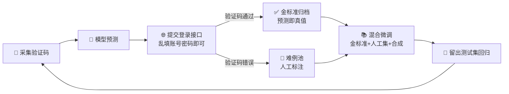

<div align="center">

# 🎯 验证码识别器

**通用验证码识别模型（CRNN+CTC，任意尺寸验证码）· 用户脚本（脚本猫/Tampermonkey）· 完整工具链**

> 🔬 训练 ｜ 🧪 评估 ｜ 🔄 数据飞轮 ｜ 📦 ONNX 导出 ｜ 🐱 用户脚本
>
> 仅用于 **已授权测试环境** 的自动填充集成

[](https://github.com/Conastin/VerificationCode)
[]()
[]()
[]()
[](#-用户脚本scriptcattampermonkey)
[]()

</div>

---

## ✨ 特性一览

| | 亮点 |
|---|---|
| 🌐 | **通用单模型**：CRNN+CTC，变宽输入/变长输出，不假设验证码尺寸、字符落位与个数——一套权重服务任意站点，新站点零适配 |
| 📊 | **服务器实测双站验证**：两个风格迥异的真实站点，单次识别 95~97%（含涂鸦干扰、彩色字符、含易混字符 0/O/I/L），自动重试后任务成功率 99.9%+ |
| 🔁 | **服务器反馈数据飞轮**：登录接口的验证码校验结果即免费标注器——"通过"的预测直接归档为金标准，"拒绝"的进难例池人工标注；240 张人工标注起步，飞轮滚到 95%+ 全程仅需人工参与 <1 小时 |
| 🎲 | **域随机合成**：40 字体/随机尺寸/变长 3-6/彩字/涂鸦线/形变/JPEG 伪影，纯合成数据即可冷启动（旧站零样本 24%→微调后 97%+） |
| 🐱 | **用户脚本分发**：一键安装（脚本猫/Tampermonkey 通用），**自动发现**验证码图+输入框，模型经 jsDelivr CDN 随版本分发、本地缓存离线可用 |
| 📦 | **ONNX 导出**：单文件 10.5MB 动态宽度，Python / JS 双端推理结果逐位一致 |

---

## 📊 性能（均为真实登录接口服务器判定）

| 站点风格 | 单次识别 | 说明 |
|---|---|---|
| 80×34 彩色字符+45°涂鸦干扰线（含 0/O/I/L） | **95~97%** | 通用模型 v11，留出测试集 95%，字符级 98.7% |
| 60×20 单色等宽（旧版专用模型） | **99.9%** | `checkpoints/best.pt`（31 类字符集，独立测试集 1000 张） |

- 单次 95% + 扩展自动刷新重试（≤5 次）→ **任务成功率 99.9%+**
- 模型置信度经 900+ 次服务器判定校准：conf≥0.97 的预测实际正确率 95.5%+，可直接用作提交门限
- 完整迭代数据（v1→v13 共 19 轮服务器实测）见 `reports/portal_login_validation*.csv`

### 瓶颈归因（四组对照实验）

剩余 ~4% 错误的归因已用对照实验钉死：容量加大（LSTM 256×3）无差异、真难例加权无差异（且模型连训练内难例都无法完全记忆）、slot 切格不可行（字符中心抖动 p90=9px）、显式喂饱和度通道无差异——**瓶颈是涂鸦遮挡造成的像素级信息上限**，不是模型或数据量。继续提分的空间在提交侧（低置信刷新/重试），不在识别侧。

---

## 🚀 快速开始

环境：Python 3.14 + PyTorch 2.12（CUDA 13.0）+ onnxruntime

```bash
python -m venv .venv
.venv/Scripts/pip install --index-url https://download.pytorch.org/whl/cu130 torch torchvision
.venv/Scripts/pip install -r requirements.txt
```

> 🔧 连接测试目标：工具链通过环境变量读取目标站点（`PORTAL_BASE`/`OLD_SITE_BASE`/`PORTAL_USER`/`PORTAL_PASSWORD`），复制 `.env.local.example` 为 `.env.local` 填入实际值（不入库），或直接用各命令的 `--base-url/--user/--password` 参数。

---

## 🐱 用户脚本（ScriptCat / Tampermonkey）

`userscript/captcha-autofill.user.js`——推荐搭配 [脚本猫 ScriptCat](https://docs.scriptcat.org/)（国内更友好，商店可装、云同步，完全兼容 Tampermonkey 脚本）。

### 📦 安装

| 方式 | 步骤 |
|---|---|
| 市场安装 | [脚本猫脚本市场](https://scriptcat.org/zh-CN/search) 搜索"验证码自动识别填充"（上架后可用） |
| 粘贴安装 | 脚本猫 → 新建脚本 → 粘贴 [captcha-autofill.user.js](userscript/captcha-autofill.user.js) 全文保存 |
| 链接安装 | 浏览器打开 `https://fastly.jsdelivr.net/gh/Conastin/VerificationCode@master/userscript/captcha-autofill.user.js` |

### ✨ 功能

- **自动发现**：DOM 启发式检测验证码图 + 输入框（关键词/尺寸/邻近度配对），顶部横幅确认「启用 / 微调 / 忽略本站」；微调模式下两次点击重选图和框
- **本地识别**：通用 CRNN 模型（10.5MB）经 jsDelivr CDN 随版本分发，首次自动下载（带进度），Cache API 按版本缓存后离线可用；三级容灾（缓存 → @resource → 多 CDN 直拉）
- **自动填充**：置信度 ≥0.9 填入输入框；不足则点击刷新重试（最多 5 次）；用户手动输入不会被覆盖
- **菜单**：手动识别当前页 / 清除本站配置

### 🔁 自动更新

脚本头部声明 `@updateURL`/`@downloadURL`（jsDelivr @master）+ `@version`，管理器定时检查并提示升级；
模型与脚本同版本号发布（tag 路径锁定），更新脚本时自动拉取对应版本模型。

### 🔁 失败样本收集（数据闭环）——规划中

识别失败自动收集导出能力正在从扩展形态移植（`GM_download`），当前 PoC 阶段可手动截图反馈。


### 📦 安装

脚本猫/Tampermonkey → 新建脚本粘贴 [captcha-autofill.user.js](userscript/captcha-autofill.user.js) 全文保存，或浏览器直接打开原始文件链接安装。

### ✨ 与扩展的差异

| | 扩展 MV3 | 用户脚本 |
|---|---|---|
| 安装 | 开发者模式加载 | 管理器内一键/粘贴 |
| 配置方式 | 可视化点选配置条 | **自动发现**：DOM 启发式检测验证码图+输入框（关键词/尺寸/邻近度配对），横幅确认「启用 / 微调 / 忽略本站」，也可两次点击手动微调 |
| 模型分发 | 打包进扩展 | 首次从 jsDelivr CDN 下载（10.5MB），Cache API 按版本本地缓存，之后离线可用；三级容灾（缓存 → @resource → 多 CDN 直拉） |
| 失败样本收集 | ✅ IndexedDB + ZIP 导出 | 🚧 PoC 暂未包含 |

> 📝 模型通过 jsDelivr 的 GitHub 镜像分发（`/gh/Conastin/VerificationCode@v3.0.0/...`），无需自建服务器；国内走 fastly.jsdelivr.net 节点。

---

## 🔁 数据闭环方法（服务器反馈飞轮）

登录接口对验证码的校验结果是**免费且 100% 可靠的标注器**：



- **金标准比人工更可靠**：服务器判定的"通过"意味着预测就是真值；实测 6 轮飞轮 + 3 场实时标注，240 张人工标注起步滚到 95%+
- **实时人在环标注**（`live_label_server.py`）：后台线程持续采集，高置信自动提交收金标准；**低置信挂起不提交**（验证码与会话绑定 ≥10 分钟，实测可延迟提交），浏览器页面人工即时标注后提交验证——"人工书写+服务器确认"双保险
- ⚠️ 每张验证码只有**一次**提交机会（CAS 票据一次性）；数据归档 append-only + manifest + SHA-256 去重

---

## 🛠️ 命令行工具

### 通用模型管线（CRNN+CTC）

| 命令 | 用途 |
|---|---|
| `train_universal` | 训练通用模型（域随机合成流，变宽输入） |
| `finetune_universal` | 真实+合成混合微调（`--real` 多源加权） |
| `synth_universal` | 域随机合成生成器（可独立出预览拼图） |
| `export_v11_onnx` 脚本 | 动态宽度 ONNX 导出（见 `tmp/portal/export_v11_onnx.py`） |
| `analyze_portal` | portal 样本推理统计（置信度分布/长度分布/预测拼图） |
| `compare_portal_sheet` | 新旧模型同图对比拼图（人工抽查用） |

### portal 站点工具链

| 命令 | 用途 |
|---|---|
| `portal_login_validate` | 真实登录接口验证（服务器判定，支持 `--fold-case`） |
| `portal_autolabel` | 自动标注闭环（金标准/难例分档归档） |
| `live_label_server` | 实时人在环标注服务（低置信挂起+人工即时标注+防手误道闸） |

### 旧站专用模型管线（slot 模型）

| 命令 | 用途 |
|---|---|
| `evaluate` | 评估：`--checkpoint checkpoints/best.pt --data data/real_test_independent` |
| `capture_real` | 采集并按识别结果命名（manifest 记录置信度，可做可信自动标注） |
| `finetune_real` | 真实 + 合成混合微调（防遗忘） |
| `export_onnx` | 导出单文件 ONNX |
| `login_validate` | 真实登录校验（服务器端判定） |

其他小工具：`analyze_confusion.py`（混淆对分析）、`verify_captcha.py`（人工核对）、`organize_real.py`（批次整理）、`slot_crop_check.py`（切格可行性诊断）、`vlm_eval.py`（多模态 LLM 实测，结论：不如专用 CNN）。

<details>
<summary>📂 数据目录组成（✅ = 随仓库分发，🔒 = 本地保留）</summary>

```text
data/real_test_independent/     # ✅ 1000 张旧站独立测试集（人工标注，勿用于训练）
data/real_human/                # ✅ 1791 张人工精确标注子集
data/portal_raw/                # 🔒 portal 真实采集样本
data/portal_label/              # 🔒 portal 人工标注（train 240 / test 60 永久留出 / 难例 4 轮）
data/portal_dataset/            # 🔒 金标准归档（6 轮飞轮 + 3 场实时标注，~8.9k 张，append-only）
data/old_slot_labeled*/         # 🔒 旧站 slot 模型自动标注可信子集（~2.9k）
checkpoints/best.pt             # ✅ 旧站专用模型（99.9%）
checkpoints/universal_crnn_ft_portal_v11.pt  # 🔒 通用模型 v11（扩展/脚本内置同款）
```

</details>

---

## 📁 项目结构

```text
├── verification_code/       # 模型、训练、评估、微调、导出、portal 工具链
│   ├── model.py             # 旧站专用 slot 模型
│   ├── train_universal.py   # 通用 CRNN+CTC（变宽/变长）
│   ├── synth_universal.py   # 域随机合成生成器
│   ├── finetune_universal.py
│   ├── portal_login_validate.py   # 登录接口真值验证
│   ├── portal_autolabel.py        # 自动标注闭环
│   └── live_label_server.py       # 实时人在环标注（localhost:8765）
├── userscript/              # 用户脚本（ScriptCat/Tampermonkey）+ 通用模型 onnx
│   └── captcha-autofill.user.js  # 自动发现 + CTC 识别 + 低置信重试
├── tmp/portal/              # 实验脚本（探针/采集/基准/标注工具生成器）
├── tests/                   # pytest
├── reports/                 # 19 轮服务器实测记录、预测对比
├── DATASETS.md              # 数据集说明（来源/划分/标注可靠性分级）
└── requirements.txt
```

> 📂 **全部数据集已随仓库公开**（图片均为验证码字符图，无隐私；详见 [DATASETS.md](DATASETS.md)）。目标站点信息一律使用环境变量（`.env.local`）注入，仓库内不含任何真实站点/账密。

---

## 🧪 运行测试

```bash
.venv/Scripts/python -m pytest -q
```

---

## ⚠️ 已知边界

- 🌐 通用模型对**训练时未覆盖的新风格**首识率会下降，用「失败样本收集 → 数据飞轮」一轮微调即可拉起
- 🎨 目标验证码若含涂鸦遮挡，单次识别存在**像素级信息上限**（本项目实测 ~95-97%），设计集成时请配合低置信刷新/重试策略
- 🔤 字符集为 36 类（大小写折叠，登录校验大小写不敏感场景）；若目标站点区分大小写需扩展为 62 类重训
- 🛡️ 验证码识别仅用于已授权测试环境的自动填充集成，请遵守目标系统的使用条款

---

## ⚖️ 免责声明

> 本项目仅用于**已授权测试环境**的安全研究与自动化填充集成，不包含登录提交或验证码绕过逻辑。请遵守目标系统的使用条款与当地法律法规，使用者需自行承担使用后果。
