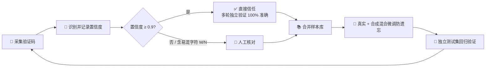

<div align="center">

# 🎯 验证码识别器

**60×20 四字符验证码识别模型 · 完整工具链 · 浏览器自动填充扩展**

> 🔬 训练 ｜ 🧪 评估 ｜ 🔧 微调 ｜ 📦 ONNX 导出 ｜ 🧩 浏览器扩展
>
> 仅用于 **已授权测试环境** 的自动填充集成

[](https://github.com/Conastin/VerificationCode)
[]()
[]()
[]()
[]()
[]()
[]()

</div>

---

## ✨ 特性一览

| | 亮点 |
|---|---|
| 🏆 | **高精度**：独立测试集 1000 张全对 **99.9%**（char-level 99.98%）；配合"置信度 ≥0.9 才接受"拒识策略，实际准确率 **100%** |
| 🧠 | **SlotCaptchaModel**：整图按固定 15px 槽位裁剪成 4 张 15×20，共享单字符 CNN 分类（全图共享 backbone 只能到 74%，槽位裁剪达 99%+） |
| 🔤 | **31 类字符集**：`23456789ABCDEFGHJKMNPQRSTUVWXYZ`，排除 0/1/I/L/O 易混淆字符（36 类难例集 88% → 97.7%） |
| 🔁 | **数据闭环**：采集 → 置信度分级 → 混合微调 → 独立回归，样本库 3200 → 10200 张后准确率 98.9% → **99.9%** |
| 🎯 | **置信度校准**：≥0.9 分档经多轮独立验证零错误，生产可直接拒识 |
| 🧩 | **浏览器扩展**：图片验证码 WASM 本地识别（零外网依赖）；纯文字验证码 DOM 直读填充、无需模型；**可视化点选配置** |
| 📦 | **ONNX 导出**：单文件含全部权重（9.6MB），Python / JS 双端推理结果一致 |

---

## 📊 性能

### 独立测试集

1000 张全新采集、未参与训练、全量人工核对（`data/real_test_independent`）：

```text
full-image accuracy: 0.9990   (999/1000)
char-level accuracy: 0.9998
per-slot accuracy:   [1.0000, 1.0000, 1.0000, 0.9990]

拒识阈值 0.9：覆盖率 99.0%，准确率 100%
```

### 真实登录校验（服务器实测）

使用测试账号向真实登录接口提交，由服务器验证码校验判定：

```text
50 次真实登录提交：验证码通过 50/50（100%），验证码错误 0
判定证据明细：reports/login_validation.csv
```

> 📌 **判定规则**：响应含"验证码不正确" → 识别错误；否则验证码通过（进入凭据校验）。页面固定文案不能作为错误标记，判定只认服务器动态提示。

---

## 🚀 快速开始

环境：Python 3.14 + PyTorch 2.12（CUDA 13.0）+ onnxruntime

```bash
python -m venv .venv
.venv/Scripts/pip install --index-url https://download.pytorch.org/whl/cu130 torch torchvision
.venv/Scripts/pip install -r requirements.txt
```

---

## 🧩 浏览器扩展（MV3）

`browser/extension/` 是 Manifest V3 扩展，支持两种验证码形态，**统一可视化点选配置**：

- 🖼️ **图片验证码**：`` 元素，识别在浏览器本地完成（onnxruntime-web WASM）
- 🔤 **纯文字验证码**：DOM 明文渲染（如 skylumo.cc 的 4 位数字验证码），直接读取文本填充，**不加载模型**

### 📦 安装

| 方式 | 步骤 |
|---|---|
| 源码版 | `chrome://extensions` → 开发者模式 → 加载已解压的扩展程序 → 选择 `browser/extension` |
| 发布版 | 从 [Releases](https://github.com/Conastin/VerificationCode/releases) 下载 `verification-code-extension-vX.Y.Z.zip`，解压后按源码版方式加载（zip 由 GitHub Actions 自动打包发布） |

### 🎮 使用（30 秒上手）

**可视化配置（推荐，图片/纯文字通用）**：

1. 🖱️ 打开验证码页面，**页面任意位置右键** → 「配置本站验证码」（或点扩展图标 → 「页面内可视化配置」）
2. 📍 页面顶部出现浮动配置条，点「验证码元素」→ 页面上**悬停高亮、点击选中**（选中 `IMG` 自动识别为图片验证码，其余为纯文字）
3. ⌨️ 同样点选「输入框」；「更换验证码按钮」可选（失败时自动点击重试）
4. 💾 点「保存配置」：选择器自动生成，**立即生效无需刷新**，验证码自动填充

再次打开配置条会**回显已有配置**，已配置元素直接高亮标注，可随时重选。

<details>
<summary>🔧 手动配置（popup 高级选项）</summary>

扩展图标 → popup 填写选择器（图片/纯文字），可选文本正则（默认提取 3~8 位字母数字），点「测试选择器」可在页面高亮验证。

skylumo.cc 示例：

| 字段 | 选择器 |
|---|---|
| 文字选择器 | `p.text-emerald-500` |
| 输入框选择器 | `#verify-input` |
| 更换验证码按钮 | `button[class*="border-emerald-500"]` |

</details>

### 📜 行为约定

| 模式 | 行为 |
|---|---|
| 🖼️ 图片 | 置信度 <0.9 自动点击验证码刷新重试（最多 5 次，60 秒后重置）；手动刷新也会触发重新识别（MutationObserver 监听 `src`） |
| 🔤 纯文字 | **只填充不提交**；页面出现"验证码不正确"类提示时，自动点击更换验证码并重新填充（最多 5 次） |
| 🤝 通用 | 用户手动输入不会被覆盖；配置按 `location.origin` 持久化，每站只需配置一次 |

### 🔁 失败样本收集（数据闭环）

识别置信度不足（<0.9）或提交后提示"验证码不正确"时，扩展自动保存验证码图片、预测、置信度与失败原因（本地 IndexedDB，上限 2000 条，自动去重）。点扩展图标 → **导出 ZIP**：`*.jpg` + `capture_manifest.csv`（与 `capture_real.py` 同格式）+ `failed_meta.json`。

<details>
<summary>📥 导入修正闭环</summary>

```bash
# 1. 解压 ZIP 到 data/fail_batch，人工核对（低置信度优先）
.venv/Scripts/python -m verification_code.verify_captcha --dir data/fail_batch --max-conf 0.9

# 2. 整理并入人工集（输出 data/real_human）
.venv/Scripts/python -m verification_code.organize_real --human-dirs data/fail_batch

# 3. 微调（真实 + 合成混合防遗忘）
.venv/Scripts/python -m verification_code.finetune_real \
    --base checkpoints/best.pt --real data/real_all \
    --syn-train data/train31 --syn-val data/val31 \
    --out checkpoints/finetuned --epochs 60
```

</details>

> 📝 **失败判定说明**：提交失败当页面出现"验证码不正确"类提示时保存 —— 支持动态插入文本/元素、既有元素文本变化、整页刷新后静态提示三种形态（配合填充时持久化的图片快照，60 秒内且同站点才触发）；保存的是提交时缓存的图片快照，站点刷新验证码也不影响。跨域图片无法读取像素时跳过保存。

浏览器端识别演示页：`python browser/server.py` 后访问 `http://127.0.0.1:8000/browser/`（含 JS 与 Python 基准一致性对比）。

---

## 🔁 数据闭环方法（难例挖掘）



实测效果：样本库 3200 → 10200 张后，独立测试集全对 **99.9%**（此前 98.9%）。

---

## 🛠️ 命令行工具

| 命令 | 用途 |
|---|---|
| `evaluate` | 评估：`--checkpoint checkpoints/best.pt --data data/real_test_independent` |
| `infer` | 推理：`--checkpoint checkpoints/best.pt data/xxx.jpg` |
| `capture_real` | 采集并按识别结果命名（manifest 记录置信度） |
| `verify_captcha` | 人工核对低置信度 + 易混字符（断点续核） |
| `organize_real` | 整理批次 → 人工集，按阈值拆分 |
| `finetune_real` | 真实 + 合成混合微调（防遗忘） |
| `export_onnx` | 导出单文件 ONNX（含全部权重） |
| `login_validate` | 真实登录校验（服务器端判定识别准确率） |

```bash
# 登录校验示例
.venv/Scripts/python -m verification_code.login_validate \
    --user <测试账号> --password <密码> --attempts 50 --interval 2.5
```

其他小工具：`analyze_confusion.py`（易错字符/混淆对分析）、`convert_charset.py`（36→31 类转换）、`slot_crop_check.py`（裁剪可行性诊断）、`vlm_eval.py`（多模态 LLM 实测，结论：不如专用 CNN）。

<details>
<summary>🔄 采集 → 核对 → 微调 → 导出（完整命令）</summary>

```bash
# 采集并按识别结果命名（manifest 记录置信度）
.venv/Scripts/python -m verification_code.capture_real --count 1000 \
    --out data/real_captcha_new --checkpoint checkpoints/best.pt

# 人工核对：低置信度 + 易混字符（--chars 取并集，断点续核）
.venv/Scripts/python -m verification_code.verify_captcha \
    --dir data/real_captcha_new --max-conf 0.9 --chars MN3BQC

# 整理：人工核对批次 → 人工集；--max-conf 批次按阈值拆分
.venv/Scripts/python -m verification_code.organize_real \
    --human-dirs data/real_captcha_new \
    --split-dirs data/real_captcha_new2 --threshold 0.9

# 微调（人工集 + 合成混合，防遗忘）
.venv/Scripts/python -m verification_code.finetune_real \
    --base checkpoints/best.pt --real data/real_all \
    --syn-train data/train31 --syn-val data/val31 \
    --out checkpoints/finetuned --epochs 60

# 导出 ONNX（单文件，含全部权重）
.venv/Scripts/python -m verification_code.export_onnx \
    --checkpoint checkpoints/best.pt --out checkpoints/best.onnx
```

</details>

<details>
<summary>📂 数据目录组成</summary>

```text
data/real_all/                  # 10200 张训练样本（真实，含 labels.txt）
data/real_human/                # 1791 张人工精确标注子集
data/real_trusted/              # 609 张置信度≥0.9 直接信任子集
data/real_test_independent/     # 1000 张独立测试集（人工标注，勿用于训练）
data/train31/ data/val31/       # 31 类合成样本（微调防遗忘用）
data/raw/                       # 历史真实样本
```

</details>

---

## 📁 项目结构

```text
├── verification_code/       # 模型、训练、评估、采集、微调、导出等模块
├── browser/                 # 浏览器端：MV3 扩展 + 识别演示页
│   └── extension/
│       ├── manifest.json    # MV3 清单: <all_urls> 注入 + 右键菜单 + popup
│       ├── background.js    # 右键菜单「配置本站验证码」+ IndexedDB 样本存储 + ZIP 导出
│       ├── content.js       # 可视化配置条 + 图片/纯文字自动填充 + 失败样本收集
│       ├── popup.html/js    # 站点配置界面（可视化入口 + 手动选择器）+ 样本导出/清空
│       ├── shared/recognizer.js  # 共享识别核心（与演示页同一份代码）
│       ├── model.onnx       # 9.6MB 模型
│       └── vendor/          # onnxruntime-web WASM 运行时（零外网依赖）
├── tests/                   # pytest 测试
├── reports/                 # 评估报告、登录校验明细
├── data/                    # 数据（不入库，见 .gitignore）
├── checkpoints/             # 模型权重（不入库，见 .gitignore）
└── requirements.txt
```

> ⚠️ `data/`（约 300MB）与 `checkpoints/` 体积大且含内网真实样本，**不随仓库分发**。按"数据闭环方法"自行采集微调，或用 `export_onnx.py` 重新导出模型。

---

## 🧪 运行测试

```bash
.venv/Scripts/python -m pytest -q
```

---

## ⚠️ 已知边界

- 🖼️ 模型针对目标站点字符渲染风格训练，**站点改版后需重新采集验证**（独立测试集可检测漂移）
- 🔤 字符集为 31 类，若目标站点加入 0/1/I/L/O 需重新生成数据并训练
- 🛡️ 验证码识别仅用于已授权测试环境的自动填充集成，请遵守目标系统的使用条款

---

## ⚖️ 免责声明

> 本项目仅用于**已授权测试环境**的安全研究与自动化填充集成，不包含登录提交或验证码绕过逻辑。请遵守目标系统的使用条款与当地法律法规，使用者需自行承担使用后果。
